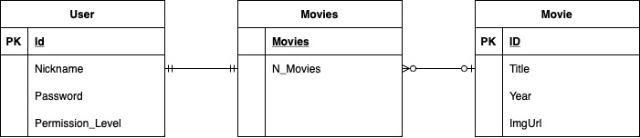

# Testowanie i jakość oprogramowania II - Projekt

### Baza Filmowa

>Dominik Pochroń  
>Bartosz Szajor

### Założenia projektowe

Celem projektu jest stworzenie aplikacji
do obsługi i przeglądania bazy filmów.
Aplikacja będzie korzystać z bazy danych filmów,
gdzie każdy z nich będzie zawierał informacje takie jak:

- Tytuł filmu
- Rok premiery
- Okładkę/plakat  

Użytkownik uzyska dostęp do bazy danych poprzez logowanie/rejestrację
użytkownika w bazie. Użytkownik o podstawowym poziomie uprawnień
będzie mógł jedynie przeglądać bazę danych, natomiast administrator
będzie mógł dodatkowo dodawać, usuwać lub modyfikować dane poszczególnych
filmów

#### Dostępne funkcje

##### Użytkownik:

- Wyszukaj film
- Sprawdź szczegóły

##### Administrator:

- Wyszukaj film
- Sprawdź szczegóły
- Dodaj film
- Usuń film
- Modyfikuj film

### Skład zespołu oraz podział zadań:

#### Dominik Pochroń:

- Utworzenie bazy danych
- Konfiguracja bazy danych 
- Utworzenie zapytań do bazy danych
- Tworzenie testów

#### Bartosz Szajor:

- Utworzenie aplikacji 
- Utworzenie funkcji odpowiedzialnych za obsługę odpowiedzi bazy
- Tworzenie testów

### Diagram ERD bazy danych:

